# 系统安装

## 1 制作u盘

[u盘制作工具下载地址](https://www.ventoy.net/en/index.html)

镜像地址, 拷贝进制作好得u盘即可

## 2 u盘安装系统

1. U盘启动, 按F7进入下图界面, 选择UEFI USB选项, 进入U盘系统的Ventoy界面

+ 工控机上电开机**按F7**进入启动项选择界面, **按Delete**进入bios选项

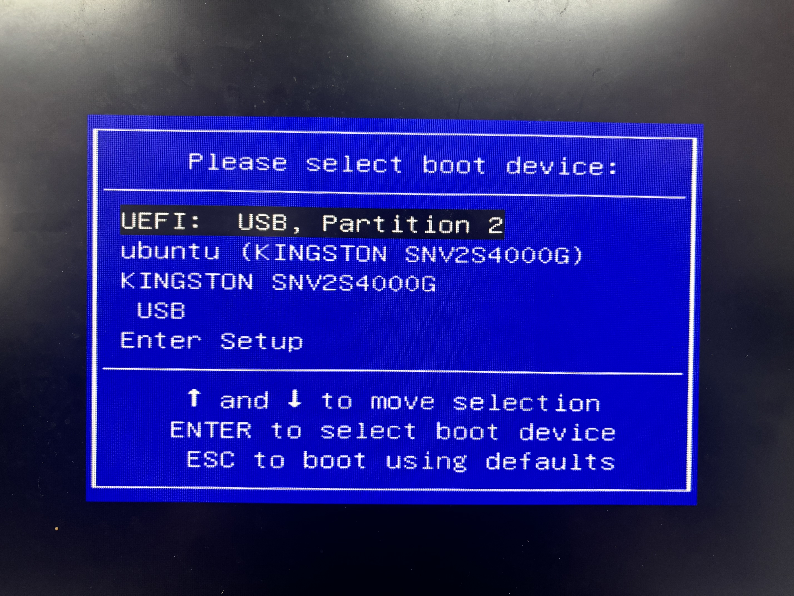

2. Ventoy界面选择aloha镜像进行安装

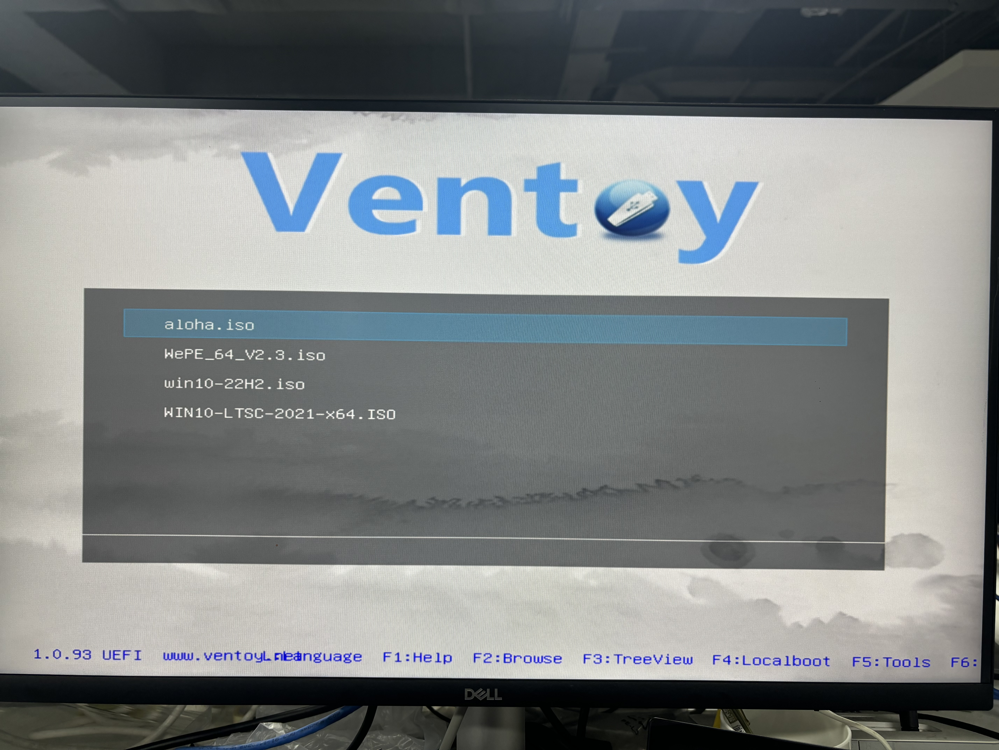

3. 选择Boot in normal mode正常模式安装
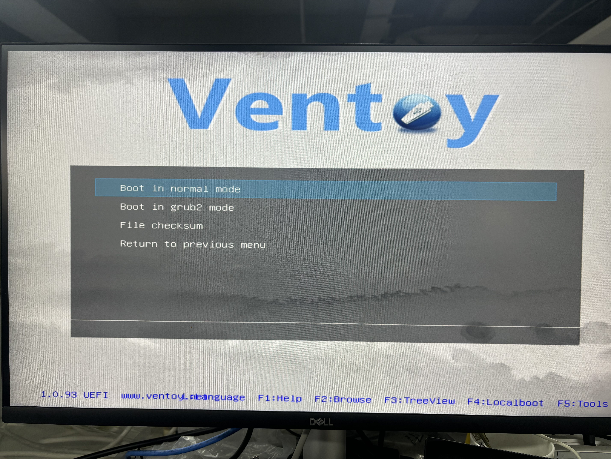

4. 进入Systemback界面后选择第二项Boot system installer进行系统安装

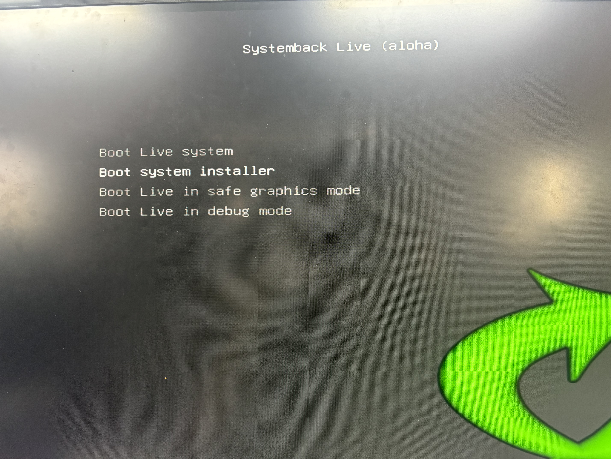

5. 直接键盘输出ctrl + C 跳过硬件检测
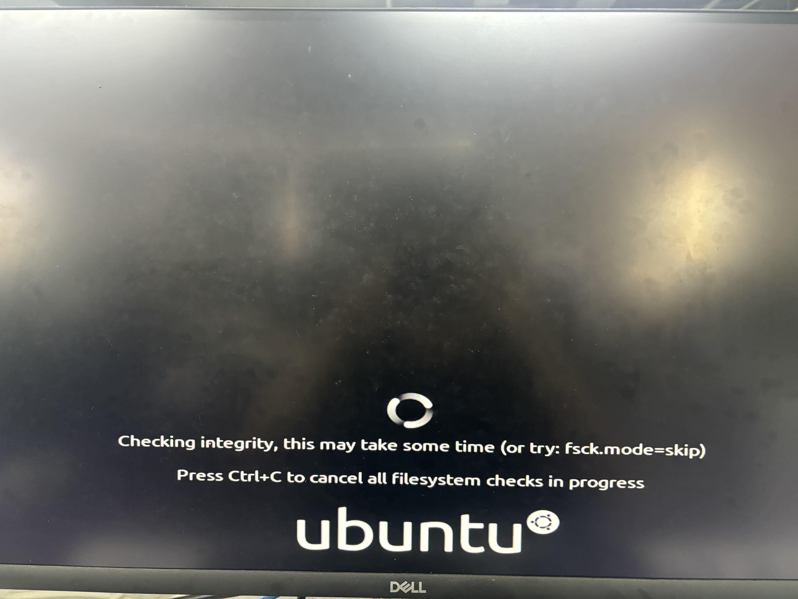

6. 进入安装界面
用户名用agilex,第一项的首字母会自动大写,不用管, root密码不用设，用户密码用agx,即可
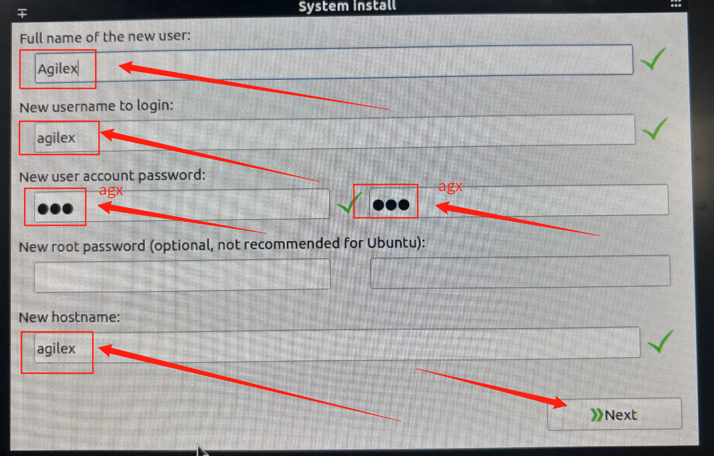

选择工控机上的硬盘, **根据硬盘容量大小判断(注意区分u盘)**, 选中硬盘后,点击Delete清除所有分区

**注意区分u盘(根据U盘容量区分), 不要手抖把U盘格式化了**

如果U盘被格式化了，需要重新制作U盘引导

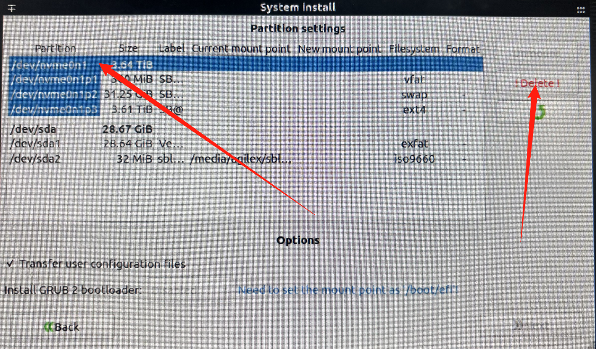

7. 新建分区
+ 分一个300M空间,给/boot/efi
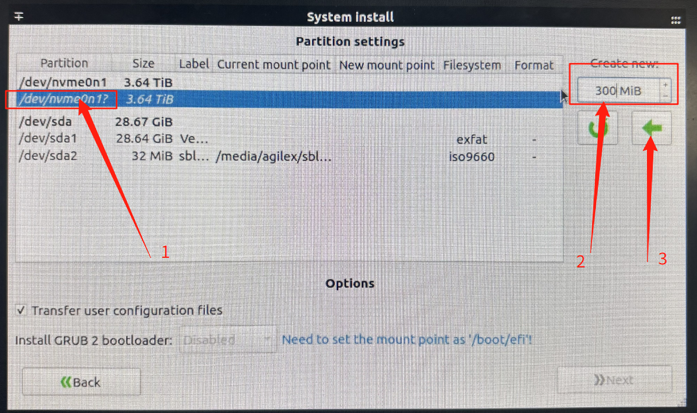
+ 分一个32000M(约32G)空间,给/SWAP
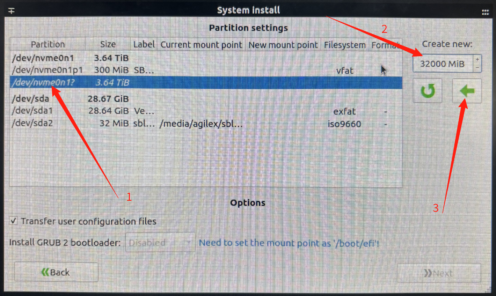
+ 剩下的空间，全部挂载到/下即可
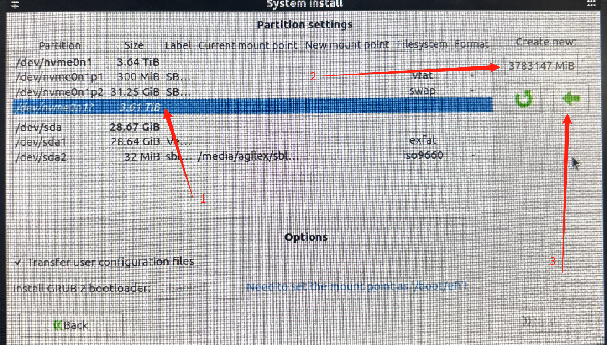

+ 给每个分区设置对应/boot/efi, /SWAP,/ 如下面3图所示操作
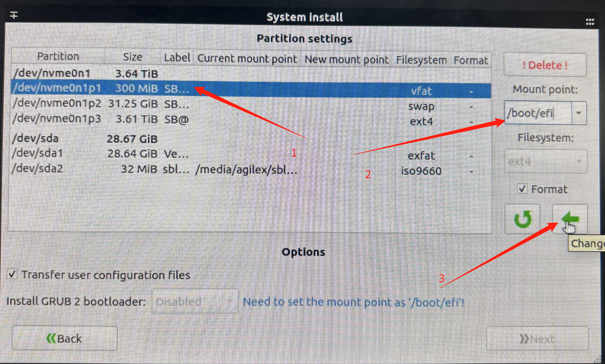

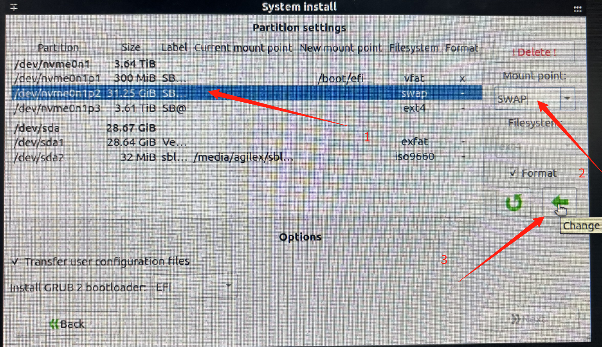

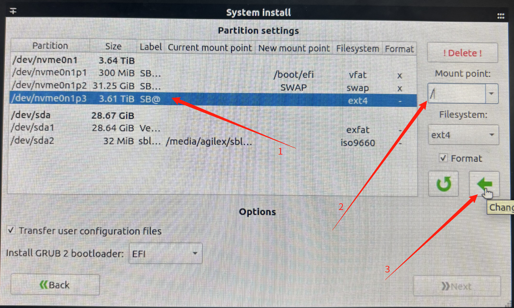

8. 检查磁盘设置
+ 设置完成后如下图所示,矩形框信息设置正确

+ /boot/efi分区设置正确 Next按钮才能被选择

+ 然后选择next即可进入系统安装

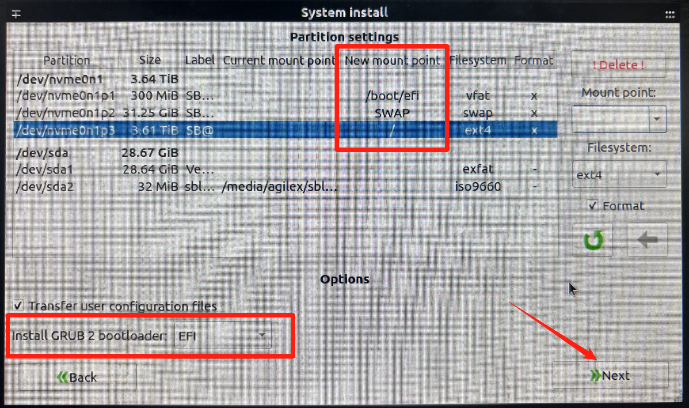

9. 正式安装系统

+ 选择Start即可
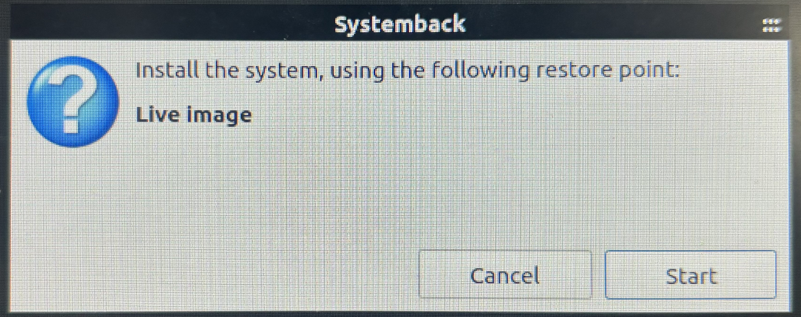

10. 安装结束后显示如下, 选择OK即可
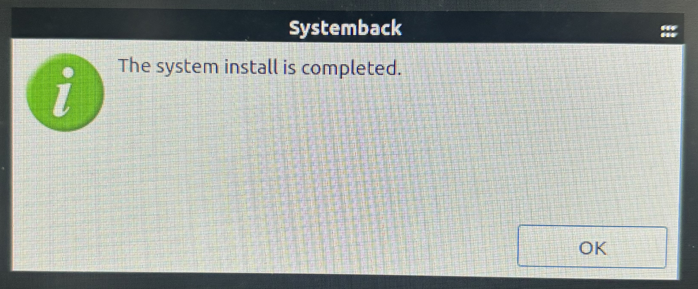

11. 启动工控机即可进入系统, 选择Reboot即可重启

+ 重启记得拔掉U盘

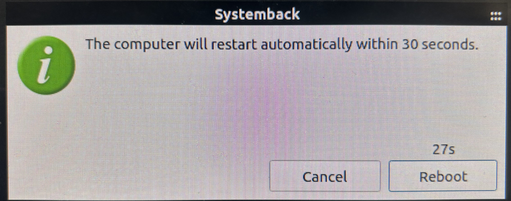