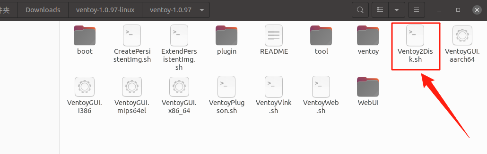
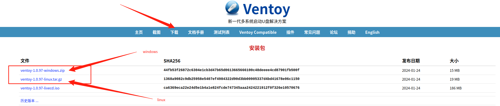
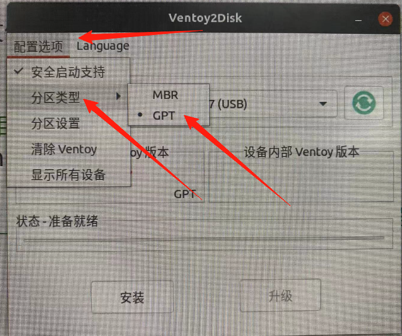
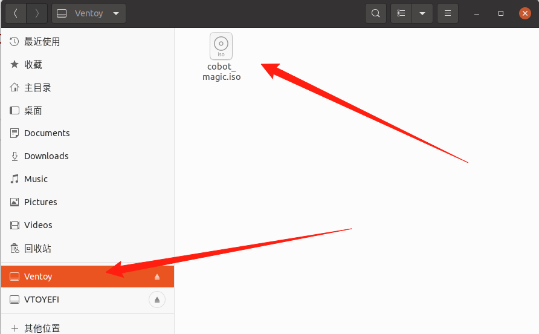

# U盘引导安装cobot_magic系统

# 1 制作引导U盘

1. [下载ventoy](https://www.ventoy.net/cn/)

如下图, 点击下载, windows系统选择windows版本，ubuntu选择linux版本

下载完成后, 右击压缩包, 选择**提取到此处**, 得到ventoy-1.0.97-linux文件夹, 内容如下图：

运行`Ventoy2Disk.sh`文件

~~~python
# 1 进入ventoy-1.0.97目录
cd /ventoy-1.0.97-linux/ventoy-1.0.97

# 2 运行VentoyGUI.x86_64, 输入密码即可得到下图所示的界面
./VentoyGUI.x86_64
~~~

2. 设置引导模型
新电脑选择GPT模式：点击配置选项 -> 分区类型 -> GPT

老电脑选择选择MBR模式

如下图所示

3. 制作启动盘
如下图：插上u盘, 点击刷新, 选择对应的u盘, 点击安装即可

+ u盘会被格式化, 制作前请备份数据
+ u盘容量大于镜像文件即可

4. 拷贝镜像文件

15.2个G大小, 用16G大小u盘即可

启动盘制作好后,会被命名为Ventoy跟VentoyEFI两个目录, 把镜像拷贝到Ventoy目录下即可,如下图所示

