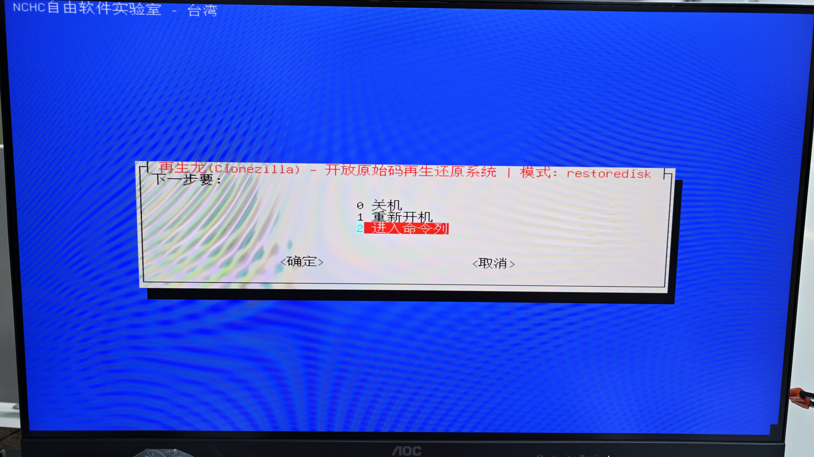

# Linux 操作系统还原操作说明 v0.1

注：只针对使用再生龙工具备份的系统文件

## 1 制作再生龙镜像U盘

使用 rufus 写入工具，将“再生龙v3.0.1-8-快速还原.iso” 镜像文件写入U盘，分区类型选择 GPT，其它默认，烧录过程中可能会失败，多重复尝试几次，如图 1 所示。

## 2.为另一个磁盘制作再生龙镜像文件

BIOS 中将再生龙 U 盘第一启动项（Boot Option #1），保存退出后从 U 盘启动，如图 2 所示。

进入该镜像后，会弹出 GRUB 菜单。默认项 `1.Auto(Restore)` 为自动还原，3s后自动选择第一项，制作镜像请不要直接回车，方向键选择另一项，如图 3 所示。

用方向键选 `2.live(Restore and Backup)`，回车`Enter`进入备份/还原交互界面，如图 4 所示。

方向键选 `Start_Clonezilla 使用再生龙`，回车`Enter`确定，如图 5 所示。

方向键选 `device-image`（硬盘/分区存成镜像，或从镜像还原），回车`Enter`确定，如图 6 所示。

方向键切换镜像存放位置选 `local_dev`（本机硬盘或 U 盘），回车`Enter`确定，屏幕下方会弹出文字说明，这个选项会将稍后制作的镜像文件存储在U盘根路径，如图 7 所示。

屏幕下方的文字说明如下，如图 8 所示。

如果要将镜像文件保存到外部U盘，则需要按提示插入用于存放镜像的 U 盘，等约 5 秒后按`Enter`；

如果不需要，将镜像文件保存到当前再生龙U盘，可以直接回车`Enter`确定；

本文示例是将镜像文件保存到当前再生龙U盘，这里直接回车`Enter`确定。

系统扫描磁盘。确认能看到系统盘（如 `nvme0n1`）和 U 盘（如 `sda`）后，

按`Ctrl+c`切回主窗口继续，如图 9 所示。

选择要挂载的镜像存储盘。

这里对应图 8中，是否插入了另一个盘作为镜像存储/读取路径，如果插入了并在图 9中识别到了，这里要选择那个盘；

注意选择的盘，存储大小需要足够大。

本文默认都是再生龙U盘路径，方向键选 U 盘数据分区（本例为 `sda1`，约 58.6G NTFS），回车`Enter`确定，也就是名字为再生龙的分区。不要选系统盘分区（`nvme0n1p*`），如图 10 所示。

文件系统检查，方向键选 `no-fsck`（跳过检查），回车`Enter`确定，如图 11 所示。

进入目录浏览器后，方向键选择`ABORT`使用 U 盘根目录。不要选标有 `CZ_IMG` 的已有镜像目录，如图 12 所示。

上下键选择目录确认无误后，按`Tab`键，然后方向键 选 `<Done>`，然后`Enter`回车，如图 13 所示。

屏幕底侧会弹出文字，看到 `/dev/sda1` 已挂到 `/home/partimag` 即表示仓库挂载成功，按 Enter 继续，如图 14 所示。

方向键选 `Beginner 初学模式`，用默认参数即可，如图 15 所示。

方向键选 `savedisk`（把整块硬盘存成镜像），回车`Enter`确定，如图 16、图 17 所示。

如果再生龙U盘的`/home/partimag/`路径下没有再生龙格式的镜像，或者再生龙U盘没有挂载外部存储镜像的盘，如图16，选项中是没有还原镜像选项的。

如果再生龙U盘的`/home/partimag/`路径下有再生龙格式的镜像，或者再生龙U盘挂载了外部存储镜像的盘，如图17，选项中是有还原镜像选项的，这个选项对应后续还原镜像时所走的步骤(在一开始选择的不是`1.Auto`而是与本节相同的`2.live`，需要在这里选择`restoredisk`)，由于本节是制作镜像，所以需要选择`savedisk`。

输入镜像名称（默认为日期，可改），回车`Enter`确定，如图 18 所示。

源盘选要备份的系统盘（本例 `nvme0n1`，空格打 `*`，如果只有一个系统盘可以直接`Enter`，多个需要方向键选择然后标`*`），不要选 U 盘，`Enter`回车选择要备份的硬盘，然后会弹到`<确定>`，然后继续`Enter`，如图 19 所示。

压缩方式选择 `-zip`（默认 gzip），方向键选择，回车`Enter`确定，如图 20 所示。

源分区检查选 `-sfck`（跳过 fsck），方向键选择，回车`Enter`确定，如图 21 所示。

保存后是否校验镜像：方向键选 `-scs` 然后回车`Enter`跳过，可缩短耗时；要更稳可选“是”，如图 22 所示。

是否对镜像加密，方向键选 `-senc`（不加密），回车`Enter`确定，如图 23 所示。

方向键选 `-p choose`（结束后再选重启/关机），回车`Enter`确定，如图 24 所示。

屏幕下方会列出备份操作完成后，会执行什么命令，核对源盘和镜像名后按`Enter`继续，如图 25 所示。

最终确认提示 `您确认要继续执行？(y/n)`，输入 `y` 回车开始备份，如图 26 所示。

Partclone 开始克隆分区，进度到 100% 即该分区完成，如图 27 所示。

出现黄色提示 `镜像保存成功` 即备份完成，如图 28 所示。

按`Enter`继续。关机/重启前务必走正常流程，不要直接拔 U 盘，如图 29 所示。

方向键选 `reboot 重新开机`，回车`Enter`确定，图 30 所示。

确认卸载仓库后会倒计时重启，如图 31 所示。

重启过程中要记得按进入BIOS的按键(delete或者其它)，，把第一启动项改回系统盘，保存退出后，系统会进入到被备份的系统中。

注意现在镜像文件在当前再生龙U盘根路径下

## 3.将制作出的镜像文件恢复到另一个电脑中

将再生龙U盘拔出，插入一个有系统的电脑

刚才制作的镜像文件，如果名字没有自定义的话，保存的路径以及名称如图所示，示例名称为`2026-09-10-06-img`，路径在U盘根路径下

将这一整个文件夹，拷贝到`/home/partimag/`路径下

这个文件夹可以本机备份一份，然后将根路径的文件夹删掉，U盘内只留`/home/partimag/`路径下的镜像，节省空间

拷贝成功后，插入到想要烧录镜像的电脑。目标电脑同样在 BIOS 中将再生龙 U 盘设为第一启动项（见图 2），进入后回车`Enter`选 `1.Auto(Restore)`，如图 36。

(如果方向键选`2.live`，回车`Enter`确定，则在选择模式之前所有的设定，与第二节备份镜像的选项相同，直到到选定模式时改选 `restoredisk`还原镜像到本机硬盘，如图 17)。

上下键选择刚才拷贝的镜像文件夹（本例 `2026-09-10-06-img`，只有一个镜像文件，直接回车`Enter`即可），回车`Enter`确定，如图 37 所示。

方向键选择要写入的目标硬盘（本例 `nvme0n1`，仅一个目标盘，直接回车`Enter`即可），回车`Enter`确定。该盘现有资料会被覆盖，确认型号和容量无误后再继续，如图 38 所示。

屏幕下方会连续两次弹出黄色警告：目标盘资料将被完全盖掉。核对镜像名和目标盘后，两次都输入 `y` 回车，如图 39、图 40 所示。

Partclone 开始按分区还原。先还原 EFI 分区（`nvme0n1p1`，体积小，很快完成），再还原系统分区（`nvme0n1p2`，耗时较长，进度条会停在这一步），如图 41、图 42 所示。等到两个分区都到 100% 即可。

还原完成后方向键选 `1 重新开机`，回车`Enter`确定，不要选 `2 进入命令列`。确认后会卸载仓库并倒计时重启，如图 43、图 44 所示。重启后进入 BIOS，把第一启动项改回系统盘，即可进入刚还原的系统。

重启过程中要记得按进入BIOS的按键(delete或者其它)，把第一启动项改回系统盘，如图 45，保存退出后，系统会进入到被备份的系统中。

## 问题解决

再生龙U盘路径`/home/partimag/`下无镜像文件，进入再生龙U盘，选择恢复选项的话，会弹出如下

需要将再生龙导出的镜像文件夹，放到U盘中`/home/partimag/`路径下，才会找到镜像文件

